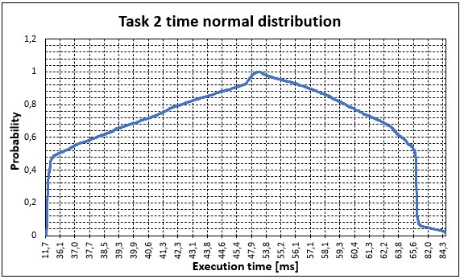
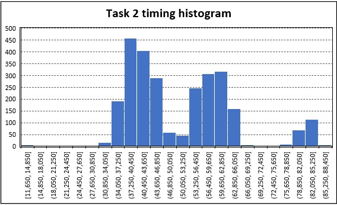

# Laboratory session 4: Programming Arduino Uno with FreeRTOS

This session is devoted to understanding the basics of programming the Arduino Uno microcontroller (ATmega328P) using a OS with its scheduler to split the code into modular tasks that can be executed at predetermined time intervals (or cycle times). This will lead to more modularity and portability for the code since this framework can be used on several architecture (called ports) that can use the same scheduler so it is not necessary to set up hardware registers on each device where this code will be used. On this case, it will be programmed using the well - known FreeRTOS framework and the session will be focused on testing small examples to check the functionalities of this scheduler and how it deals with priorities and the situations in which resources are shared between the tasks. Finally, it will be necessary to solve a final exercise to programme a control loop over the computer fan speed with FreeRTOS.

## Initial requirements: 

It will be necessary to install FreeRTOS as a library into Arduino IDE. Then the session will be completed using all Arduino IDE environment but adding this feature regarding the FreeRTOS scheduler. To install follow these steps: 

- 1. Open Arduino IDE.
- 2. Go to menu ***"sketch ->Include Library->Manage Libraries..."***
- 3. Once inside the Library Manager, select *"Type"* as **Contributed** and *"Topic"* as **Timing** and then write **FreeRTOS** on the search bar.
- 4. Select the *FreeRTOS by Richard Barry* library from the options given and install it.
- 5. Once installed, on the sketch you want to use it just make an include as *#include <Arduino_FreeRTOS.h>*.

## Proposed examples:

First of all 2 small testing examples with some questions are proposed to get started with FreeRTOS and get a better understanding about how it deals with tasks, timing, prioritization and resources. These small tests are explained below: 

### 1. Programming periodic tasks: 
On this example it is programmed a simple task to blink a LED each 500 ms and another task to print on serial output the value of an analog read sensor. The exercise is initially prepared so that blinking task has more priority than serial output task and the output of the programme when executed can be seen below:

Where it can be seen that both the blinking LED and the analog read shows some output and they are executed concurrently (one after the other) without conflicts. However, the exercise asked then to swap priorities and remove the delay on execution for task with serial output printing. These changes yield to a situation in which task for blinking LEDs is never executed since it has low priority and the serial output printing task do not have any delay so it is always ready to be executed after it is ended. 

The video with demo results after doing these changes can be found at repository [here](/P4/Videos/P4_Exercise1_Demo_mod.mp4)

### 2. Access to shared resources:

Here it is programmed a task in which there is a read to an analog input and a read to a digital input. Additionally, on each task it is send via serial output port the value of the read so both are accessing to the same shared resource as it is the serial port. Then, the initial approach considers this situation and contains a semaphore to avoid both task to access serial output at the same time and get a crash on the results and making one task wait when accessing to the serial output port until the first task finished working with it. The results of this initial situation are shown on the next image: 

Where it can be seen that all works as expected and output is properly set for each task. However, the following changes are executed over this initial programme:

- **Remove the line calling "xSemaphoreGive" inside one of the 2 tasks:** On this case, it has been removed the line on the task performing the digital read sensor. The result of this is that it is only executed one time the task for the digital read and no other task can be performed after that (not even the digital read task) because the semaphore has been taken by someone and never released after ending the first digital read task loop. Then, any task attempting to get the semaphore status will check that it is busy forever and all will be blocked without possibility to be executed. The results of these explanations can be shown at the following image presented: 

- **Remove all lines regarding MUTEX in both tasks:** On this situation, both tasks will attempt to access to the same resource leading to a crash and non-desired outputs on serial port reads because both tasks will attempt to write on serial output and the outputs of each function there will be mixed. Therefore, on this case both tasks can be executed constantly and they are not blocked but the outputs are not as depicted in the initial programme code where everything was clear and separated by task. These results can be shown on the next image: 

Where it can be seen that the output on terminal received from Arduino is unpredictable and changes constantly showing on each line random combinations of the serial output given by each task. Then, it is clear both tasks are trying to write information into the same resource and the problem appear.

## Proposed exercise:

Last, it is proposed the exercise in which it is necessary to programme a control loop for the computer fan speed using 3 different tasks to achieve this with different timings, but the priorities will be defined by the engineer programming the solution. The three tasks that are created as problem specifications are shown below:

- **TaskSetpointGenerator:** This task will be executed each 10 s to change the setpoint of the control loop between 2000 and 3000 rpm constantly. It will have maximum priority (3) so that it will be executed when it is necessary above the other tasks to change the setpoint for next control loops.
  
- **TaskControlLoop:** This task will be executed each 100 ms to read the computer fan sensor F00 speed via pin 7 (PD7) and then compute the next control action (PWM duty cycle value) to send it via pin 3 (PD3) to the fan to control its speed based on the difference between the actual fan speed and the imposed setpoint. The controller selected to do this task is the one obtained in previous [Laboratory session 2 - Exercise 5](/P2/README.md/#5-pid-control) with the PID approach and all parameters tunned on that exercise will be used here to ensure the same performance is obtained on the control on this exercise. This task will have priority 2, so it will have less priority than first task presented, but it will have more priority than task 3 that is shown below

- **TaskSerialOutput:** This task will send via serial output each 200 ms the values of RPM sensed from computer fan F00 sensor and the actual setpoint for the fan speed. On this manner, it can be visualized the results for the control loop on the Arduino serial plotter. Additionally, this task will have the least priority (1), being the last to be executed when more than one task is in ready state for the scheduler.

The results of programming this architecture with these tasks and these priorities is shown on the following snapshot from Arduino plotter, where it is clear to check that control loop is performing as results presented in the [PID control exercise for laboratory session 2](/P2/README.md/#5-pid-control). Therefore, it is clear it has been possible to obtain a modular code structure using the FreeRTOS scheduler that allows to respect the timings imposed and executes the tasks within given time constraints because the parameters for control loop are prepared for a sampling time of 100 ms and the performance in discrete - time is the same as in laboratory session 2.

And also the video demos with the results for this exercise can be found at repository [here](/P4/Videos/P4_Ex_Demo1.mp4) and [here](/P4/Videos/P4_Ex_Demo_2.mp4).

### Checking tasks temporal correctness:
Finally, as additional request, it is necessary to ensure temporal correctness of the task where the control loop is performed (**TaskControlLoop**) to ensure it is executed each 100 ms because it is the most critical task here. 

For this reason, it has been used in all tasks the function *vTaskDelayUntil()* from FreeRTOS library to be sure each task is called after the defined number of ms on this function arguments instead of wait the defined number of ms from the moment the last function call is finished. The first approach will ensure (if the task computing time is less than the defined task cycle time) the time between task executions will be always the task cycle time defined meanwhile the latter will wait the defined task cycle time after the function call is finished, leading to unpredictable cycle time for the task and time between task executions because it will depend on the computing time for each function call. Then, the approach using function *vTaskDelayUntil()* is way more precise and suits better for the criticism of control loop task that is expected to be called each exactly 100 ms, but it is necessary to ensure the task 2 computing time is never exceeding the giving cycle time period (100 ms). Next, in Arduino it has been programmed with *micros()* function some variables to gather times when each task start and when each task ends and in task **TaskSerialOutput** it has been added to serial output these timing values for each loop so that they can be copied on a *.txt* file that can be processed into Excel to get statistical data for the computing time of control loop task. 

The conducted experiment is presented below:

- **Prepare output data for processing:**: It is added to serial output in Arduino a line that includes the following fields separated by ";" on the output: task 1 computing time, task 2 computing time, task 3 computing time, task 1 cycle time, task 2 cycle time and task 3 cycle time. This will be the study variables later on.
- **Get data with Arduino during 5 minutes:** Ensures enough cycle times are executed and the worst cases scenario can be obtained. It is also obtained the data for fan speed and setpoint on the output as expected.
- **Store all data on *.txt* file:** This can be found inside folder **Utils** with name *Temporal_correctness_data_raw.txt* after removing all results obtained for rpm fan speed and setpoints on the otuput.
- **Process data to be exported to Excel:** The original file with all data is modified to be exported to Excel properly. This file is also inside folder **Utils** with name *Temporal_correctness_data.txt* and this is the one to insert into Excel to process data. Here decimal points has been substituted by commas and the separator between variables is changed from ";" to tabulator spaces.
- **Generation of Excel file:** Data is inserted here, computed the mean, standard deviation and interval of confidence for each study variable. Next it is found the histogram and the normal distribution for control loop task (**TaskControlLoop**) to obtain the appropriate results. This file is stored in folder **Utils** with name *Temporal_correctness_data.xlsx*. 

Then, from experiment done the following statistical results are shown for task 2 (control loop task) computing time and task cycle time:

| **Statistical feature**       | **Value - Computing time task 2** | **Value - Cycle time task 2** |
|:-----------------------------:|:-----------------------------------:|:-------------------------------:|
| Max value [ms]                | 86.850                            | 105.000                       |
| Min value [ms]                | 11.650                            | 95.000                        |
| Mean [ms]                     | 51.089                            | 99.009                        |
| Standard deviation            | 12.955                            | 0.319                         |
| Confidence interval (at 95%)  | $51.089 \pm 0.4867$               | $99.009 \pm 0.012$            |

And these statistical results are also highlighted on the following plotted results where it can be examined in more detail how the computing times for task 2 are distributed for the experiment done.

  

  

Then, it is clear that the temporal correctness is ensured with precision and that task 2 will be executed without any problem at the specified cycle time. The deviation to 105 ms in some occasions as shown in the maximum value for the cycle time of task 2 might be caused by some timing inaccuracies with ticks on FreeRTOS because there is also some deviations to 95 ms in some occasions (shown by minimum value), but it has not been explored in depth.