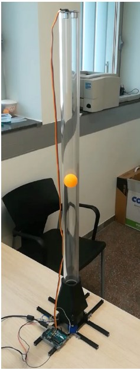

# Laboratory session 5: Programming the "Ball in Tube" system with Arduino IDE

This session is devoted to implement different control strategies using the **"Ball in Tube"** system platform. This platform is an experimental prototype where a ping-pong ball is inside a methacrylate tube with a fan on the bottom and an ultrasonic distance measurement sensor on top so that it is aimed to place the ping-pong ball always within a distance from the lowest part of a slot placed on the tube. Therefore, the different control strategies will be tried to control in the best manner the system dynamics so that the ball is placed on a given setpoint. An example of the platform to be controlled is presented on the images below.

  
  

To achieve this purpose on session 5, it will be used the same Arduino Uno microcontroller (ATmega328P) as used on previous sessions and the Arduino IDE as code editor and to compile and upload the code to the device. Then, a set of 3 exercises using 3 different control strategies are proposed to control the system and to check the performance between them:

## 1. ON/OFF distance control: 

It is first obtained PWM range in which the ball is within the tube slot part and the distance measured on each case by the ultrasonic sensor. Next, the computer fan is controlled depending on the distance sensed by the *HCSR04* ultrasonic sensor placed on top of the tube to the distance of the ball to the lowest part of the tube slot to be around 15 cm constantly. Then, an hysteresis control is programmed with 2 cm hysteresis step that contains just 2 basic states as follows: 

- **The computer fan is ON:** When distance sensed by *HCSR04* is under 13 cm (15 cm + the hysteresis step). At this control state the PWM duty cycle signal sent to the fan is constantly set to a value of 140 through pin PB1 (Arduino Uno pin 9). This value of PWM is high to position the ball within the tube above the 17 cm again (the other hysteresis extreme) and for this reason it is considered as ON state.
  
- **The computer fan is OFF:** When the distance sensed by *HCSR04* is over 17 cm (15 cm + the hysteresis step). At this control state the PWM duty cycle signal sent to the fan is constantly set to a value of 115 through pin PB1 (Arduino Uno pin 9). This value of PWM is too small so that the ball position will be under the 13 cm again (the other hysteresis extreme) and for this reason it is considered as OFF state.

On this program distance sensor value is read through analog pin in Arduino Uno at pin 11 (pin PB3) and the conversion given on datasheet is done to convert the microseconds value obtained directly to centimeters.

The Arduino plotter snapshot with the test results for this exercise is found below for the triggering of the OFF state and for the triggering of the ON state for the PWM fan with this control respectively. It can be seen that it appropriately reacts against distance sensor reading from *HCSR04* and the system works as expected being stable around the setpoint of 15 cm constantly.

The video demo with the results for this solution can be found at repository [here](/P5/Videos/Ex1_ONOFF_demo.mp4).

Finally, all data obtained on this method to obtain the ranges of distances for the sensor and the PWM values that will rely always within the tube slot can be found at **Utils** folder inside the Excel sheet called *Linear_fit.xlsx*, from where the PWM values to be imposed on the ON/OFF control are found to ensure the ball is always within a given distance from the lowest part of the tube slot.
  
## 2. Feedforward control: 

On this second approach it is proposed first to characterize the input - output static response for the system and the dynamic response for the system and then implement with the input - output static response obtained a feedforward control using any regression method (linear on this case) to approximate the input - output static gain and have an initial basic control approach valid for all the PWM range of values and distances within the tube slot.
   
To determine the input - output static and dynamic response of the computer fan when a PWM input signal is sent, it will be used the same approach as presented in [laboratory session 2 - System Identification section](/P2/README.md/#2-characterization-of-fan-response) where the distance sensor measurement is read for every PWM input given to the system. For that purpose, an incremental and decremental steps of 10 PWM values are programmed so that it is covered all range from 82 to 182 PWM signal value in increments and decrements to assess the difference on the system dynamics when applying both increments and decrements on the control signal on the system. Additionally, it is waited between steps 10 s to have the speed stabilized and get appropriate measurements that are sent inside the loop every 50 ms to the serial output monitor.  Hence, all output serial monitor data has been captured on a *txt* file called *BallResponse.txt* stored in **Utils** folder. 
    
Finally, all data gathered is opened on an Excel and it is able to obtain the following results shown on the following snapshots for the temporal static and dynamic system response respectively: 

Where it can be seen the slightly small difference on the input - output system dynamics due to the fact that the gravity effect is not necessary to be compensated on the downward dynamics so that the ball will always be on a lower distance wrt to the lowest part of the tube slot for a PWM value on a decremental step than the same PWM value applied during incremental steps. 
    
And from given previous static response it has been possible to determine experimentally the static curve that relates the value of PWM to be input to the system to achieve a desired distance with respect to the lowest part of the tube slot as follows (only considered for all the range the upward dynamics):

    

    
Next, the dynamic response of the fan is presented on the 2 following images for the analyzed data from the test done:

    
And from where it can be obtained the response time for the system to be as the settling time, which in average it has been stablished to be $t_{ss}$ at 98\% equal to $t_{ss} =1.76s$ for the upward system dynamics and $t_{ss} =1.78s$ for the downward system dynamics. Thus, here the dynamics settling time is not really different in average, but the gravity effect has indeed significance on the difference between response when applying incremental or decremental PWM step values.

Finally, all data from where all these previous results are obtained can be found at **Utils** folder inside the Excel sheet called *upd_and_down_feedforward.xlsx* where serial monitor output data from Arduino is analyzed. Additionally, the video demo with the results gathering for the system identification can be found at repository [here](/P5/Videos/Ex2_Feedforward_SysIdent.mp4).

Next, with all this data and the static curve obtained relating the PWM value and the desired distance with respect to the lowest part of the tube slot, this control approach will be tested using two different setpoint scenarios: 

- Scenario 1: setpoint varies every 10 s between 20 and 10. Then a PWM value is sent via pin 9 (PB1) to the computer fan to track the distance setpoint that is varying constantly between this 2 points and it is read on each control loop (every 50 ms) the distance read from the ultrasonic sensor on pin 11 (PB3).
- Scenario 2: setpoint varies every 10 s between 25 and 15. Then a PWM value is sent via pin 9 (PB1) to the computer fan to track the distance setpoint that is varying constantly between this 2 points and it is read on each control loop (every 50 ms) the distance read from the ultrasonic sensor on pin 11 (PB3).

The results of this simple methodology can be found on the following snapshots from Arduino plotter for both given setpoint scenarios depicted, displaying the setpoint speed against the sensor reading at each control loop. The response obtained is quite satisfying, but the controller fails when reducing the steady state error since there is always a constant shift between the setpoint and the final speed value. 

The system seems to work better when tracking on a scenario than in the other, but in overall there is a constant error to be tackled with other control approaches different than the feedforward, which cannot do it better than this.

The video demo with the results for this solution can be found at repository [here](/P5/Videos/Ex2_Feedforward_Demo.mp4).

## 3. Feedforward control + feedback control:

The last control algorithm proposed attempts to tackle the problems presented on [exercise 2](#2-feedforward-control) specially and to ensure a setpoint is tracked without zero steady state error. However, on this section it will be divided in 2 different steps, doing in the first one a simple P controller with a proportional action only and on a second step a PI controller with both the proportional and the integral control actions. On this manner, it can be both assessed and compared to ensure if it is necessary add at least an integral control action to reduce the error to 0 and its effect. The PID controller will not be designed since the trade - off between tuning effort and the performance improvement is really significant for the benefits it will have.

Consequently, this section will be divided into the 2 different steps where to test the two setpoint scenarios given in previous [exercise](#2-feedforward-control) with the feedforward:

### P control: 

A simple proportional control gain has been tuned to add to the control action a factor that depends on the error between the actual sensor reading and the distance setpoint for the ping-pong ball. Thus, the new control action as a PWM value includes a continuous time P controller with the following equation: 

$$u[PWM]=feedforward_{action}+P_{action}=0.2678\cdot PWM\_{Value}-19.128 + K_p\cdot dist\_{err}$$

Where the gain $K_p$ must be tuned experimentally for the best performance and the variable $dist\_{err}$ on the control action stands for the error between the actual distance setpoint and the ultrasonic sensor measured distance both with respect to the lowest part of the tube slot.

Hence, after tuning the $K_p$ parameter experimentally and with a sample time of 50ms for the control loop, it is obtained an optimal $K_p=1.0$ for the proportional controller. Therefore, with this controller and control action used, the presented results on the next image with respect to the setpoint between 25 - 15 cm to show the obtained control with this new feedforward and state feedback control approach.
      

From results it can be noted there is still some steady state error when applying decremental PWM values on the system meanwhile the system dynamics for the highest setpoint is adjusted properly with a small steady state error that in some cases is almost 0. This situation is due to the fact that the feedforward control has been created using only the input - output static response on the system when applying incremental PWM values, so that the gravity effect occurring on the decremental PWM values is not being into consideration obtaining errors on the output response. For this reason, the PI controller will be necessary to correct this permanent error on the steady state with the integral control effort.

The video demo with the results for this solution can be found at repository [here](https://github.com/AACMO/ERTS_Labs/blob/main/P5/Videos/Ex3_Demo_ff%2Bsf_control_sp20_10.mp4) and [here](https://github.com/AACMO/ERTS_Labs/blob/main/P5/Videos/Ex3_Demo_ff%2Bsf_control_sp25_15.mp4) for the P control demonstration for the setpoint between 20 - 10 and the setpoint between 25 - 15 respectively.

### PI control: 

A controller using a proportional and integral control action must be tuned to add to the initial control the capability to track any given setpoint and converge to 0 steady state error if enough time is given to the system. This controller must be also able to correct at least the error induced by constant disturbances such as the obstruction with the hand of the lowest part of the tube slot behind the ping-pong ball. Thus, all this situations will be checked on this section considering the new control action as a PWM value that includes both a continuous time PI controller and a feedforward gain with the following equation:

$$u[PWM]=feedforward_{action}+PI_{action}=0.2678\cdot PWM\_{Value}-19.128 + K_p\cdot dist\_{err}+K_i\cdot sum\_{err}$$

Where again the gains $K_p$ and $K_i$ must be tuned experimentally for the best performance and the variable $dist\_{err}$ on the control action stands for the error between the actual distance setpoint and the ultrasonic sensor measured distance both with respect to the lowest part of the tube slot, meanwhile the variable $sum\_{err}$ is the accumulated $dist\_{err}$ along all control time for the integral control action. However, to avoid accumulating big errors that will alter the control action and provoke non-desired behaviors, the variable $sum\_{err}$ for the control loop has been saturated on the upper and lower bounds considering the maximum distance for the tube slot on the system (30 cm from the ultrasonic sensor) as follows: 

- Upper bound for **$sum\_{err}$**:  $sum\_{err} \leq5\cdot$ MAX_DIST
- Lower bound for **$sum\_{err}$**:  $sum\_{err} \geq-3\cdot$ MAX_DIST

With MAX_DIST = 30 cm, which is the maximum distance between the ultrasonic sensor and the ping-pong ball to be within the tube slot. Note that the limits are not symmetric to compensate the bigger error due to the gravity effect that occurs when the PWM value sent to the computer fan is decremented. 

Hence, after tuning the $K_p$ and $K_i$ parameters experimentally and with a sample time of 50ms for the control loop, it is obtained an optimal $K_p=1.0$ and $K_i=0.2$ for the PI controller proposed. Therefore, with this controller and control action used, the presented results on the next images with respect to the both setpoint scenarios between 20 - 10 and between 25 - 15 cm to show the obtained control with this new feedforward and state feedback control approach using a PI action.

From results it is clear now the system is able to track any given setpoint with zero steady state error in both given setpoint scenarios, despite having some noise on the ultrasonic sensor distance measurement. However, the tuned parameters allowed to have a PI control that is moving all the time the system to the reference without being too much reactive against noise given by the sensor. 

Last, it is checked the performance of the PI controller when the lowest part of the tube is obstructed with the hand, adding some disturbance on the system in both scenarios and in both setpoints for each scenarios. The results presented on the following Figures yield that the controller designed is able converge to 0 steady state error if enough time is given with the same reference despite adding constant disturbances as the ones commented. Thus, the control is robust against this type of disturbances added as expected.

The video demo with the results for this solution can be found at repository [here](https://github.com/AACMO/ERTS_Labs/blob/main/P5/Videos/Ex3_Demo_ff%2BPI_control_sp25_15.mp4) for the PI demonstration without disturbances and [here](https://github.com/AACMO/ERTS_Labs/blob/main/P5/Videos/Ex3_Demo_ff%2BPI_control_sp20_10_dist.mov) and [here](https://github.com/AACMO/ERTS_Labs/blob/main/P5/Videos/Ex3_Demo_ff%2BPI_control_sp25_15_dist.mov) for the PI control demonstration with the disturbances included for the setpoint between 20 - 10 and the setpoint between 25 - 15 respectively.